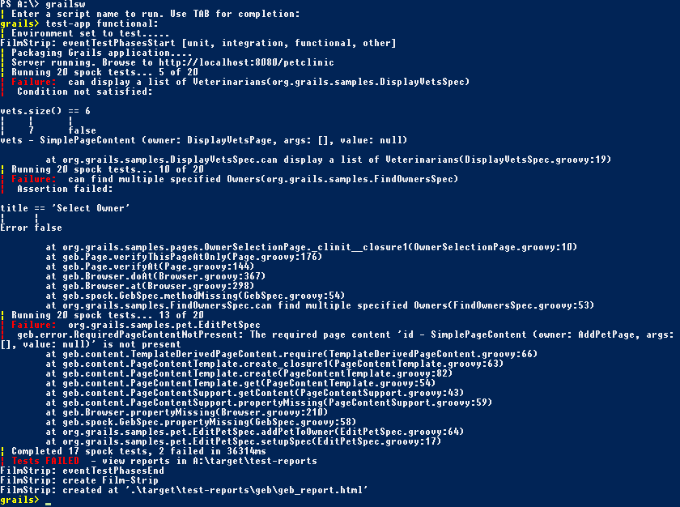

Grails Film Strip Sample Application for Grails 2.2.x
=====================================================

This fork of the famous Petclinic has been enriched with some Geb and Spock Tests 
(taken from the master branch) and the Grails Film Strip plugin. In order to run this
sample, follow these steps:

* make sure that phantomjs is installed http://phantomjs.org/ (test it by typing `phantomjs` in a shell)
* execute tests by typing `./grailsw test-app functional:` in a shell. 
* view the resulting report by opening `target/test-reports/html/geb/reb_report.html` 

you will now see the generated report in your favorite browser. The main part of the 
screen will show you the full test report with all results. On the top of the screen,
you will see all created screenshots as film strip.

Click on a screenshot and it will be displayed full size.

Click on the report name (the text displayed on the screenshot) and the page under test
will be displayed as HTML. This will look broken because all referenced files (images,
stylesheets, javascript) are not available), but you can do a right-click -> view source
to see the HTML produced by your app exactly as it was under test.

Click on the little star in front of the report name and the system tries to navigate
to the live app. In order for this to work, you have to start the app before you
click on this link.

Click on one of the spec names (the white headlines on top of the screen) and you will
see the test results of the selected spec.

-----

Petclinic Sample Application
============================

This is the standard introductory sample application for Grails. To get started with it, simply clone the repository and then from within your local copy run:

    ./grailsw run-app

on Unix-like systems, or

    grailsw run-app

on Windows via the command prompt. Once the server has started up, you can copy the URL and paste it in a browser.

Follow the tutorial link to learn about Grails or click on the View Source for Controller/View links to see the underlying code for whatever page you are currently on.
